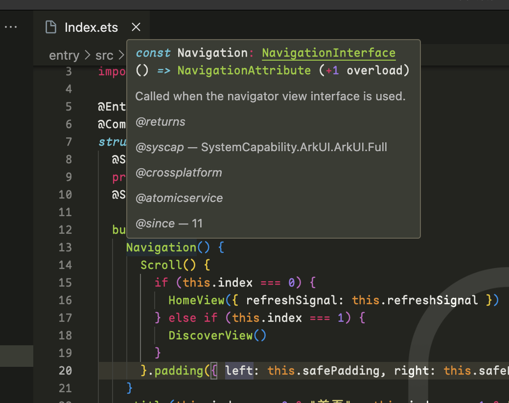
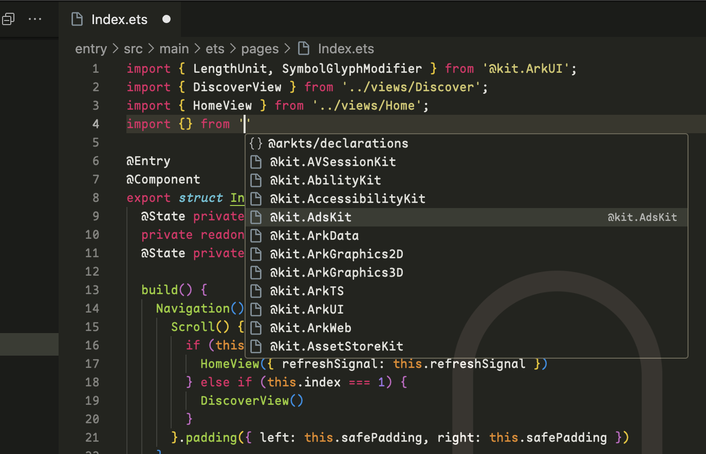
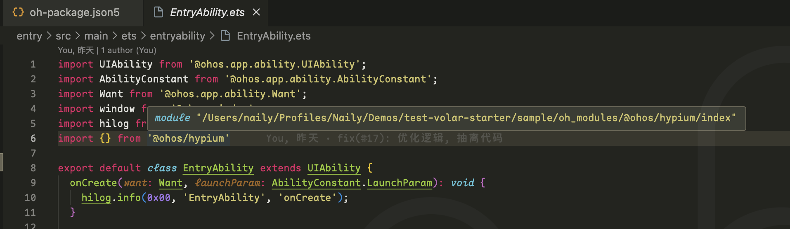
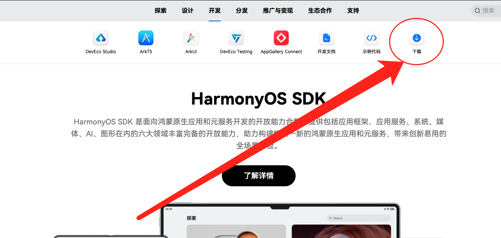
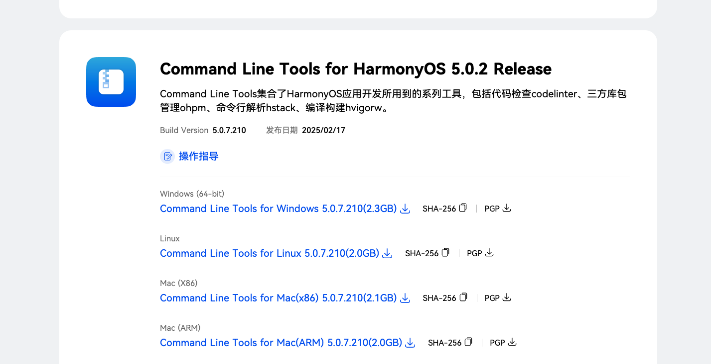
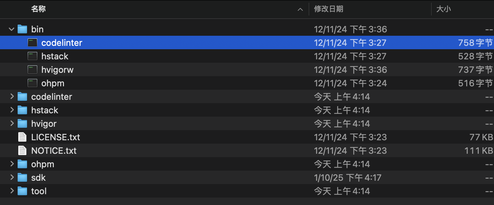
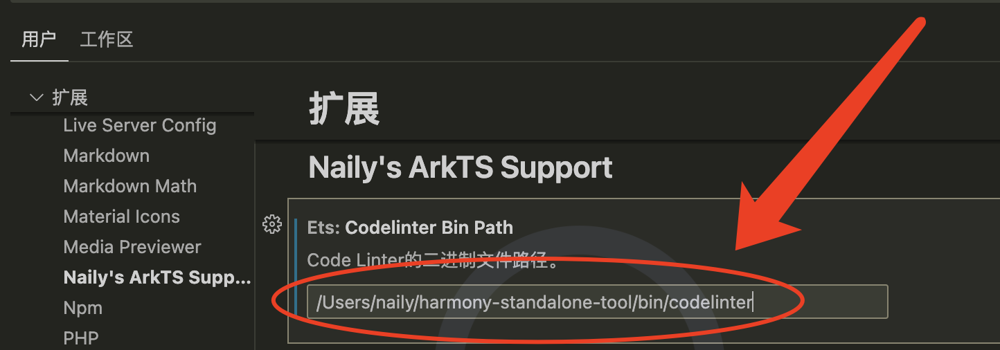
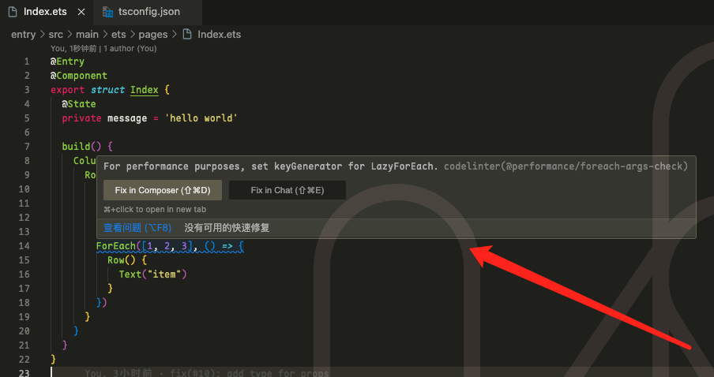

<div align="center">


# Naily's ArkTS Support

&nbsp;
[](https://marketplace.visualstudio.com/items?itemName=NailyZero.vscode-naily-ets)&nbsp;
[](https://www.npmjs.com/package/@arkts/declarations)&nbsp;
[](https://www.npmjs.com/package/@arkts/language-server)&nbsp;
&nbsp;
&nbsp;
&nbsp;

</div>

> I've created a QQ group chat, it is welcomed to join it and chat with us (Group number: 746153004)

This is a ArkTS VSCode Extension developed basic on Volar🌹Because ArkTS is still unsupport VSCode and most of the existing ArkTS extensions in the VSCode marketplace are very rudimentary, so I decided to write my own.

> ⚠️Notice: This package is basic on `API 13`, so there might be some issues if your current HarmonyOS version is below than `API 13`. It is welcomed to contribute to this Repository.

- 🖊️ Completed JSON Schema Support. Supporting JSON Schema on files below:
  - `build-profile.json5` 模块级别/项目级别配置
  - `oh-package.json5` 模块级别/项目级别配置
  - `module.json5` 模块级别/项目级别配置
  - `code-linter.json5` 模块级别/项目级别配置
  - `resources/element/`下所有的`color.json`等的kv值配置
  - `main_pages.json5`
- 🪐 Thanks to the powerful Volar. After upgrading to version 0.0.7, It is almost perfectly supports all ArkTS 语法高亮、补全以及智能提示😋👍
- 📦 Allow auto-installing `ohpm` dependency and sync `hvigor` configuration.
- 🚧 Supports in-line`codelinter`提示 like ESLint, to locate issues precisely👍
- 🀄️ 通过`tsconfig.json`配置即可完美支持`oh_modules`三方模块的导入⏬
- 🆓 `$r` `$rawfile` autocomplete, and ArkTS code formatting is coming next and welcomed to contribute👀


## Extension Installation📦

Install it on Marketplace: [https://marketplace.visualstudio.com/items?itemName=NailyZero.vscode-naily-ets](https://marketplace.visualstudio.com/items?itemName=NailyZero.vscode-naily-ets)

Or directly search `ArkTS Support`on VSCode.

## ArkTS Source Code跳转 🔍

ArkTS source code jump requires `@arkts/declarations`, so you have to install `@arkts/declarations` on your HarmonyOS project via `npm`.

```bash
npm install @arkts/declarations
```

Then, create or edit `tsconfig.json` on the root of your HarmonyOS project directory, adding following content:

```json5
{
  "extends": "@arkts/declarations/dist/tsconfig.base.json",
  "compilerOptions": {
    "types": ["@arkts/declarations"],
    "lib": ["ESNext"], 
    "experimentalDecorators": true,

    // Basic compiler and module options, it is suggested the config as below
    "target": "ESNext",
    "module": "ESNext",
    "moduleResolution": "bundler",

    // It is suggested to turn on the strict mode
    "strict": true,
    // It is suggest to turn strictPropertyInitialization off
    "strictPropertyInitialization": false
  }
}
```

Heritage this configuration and `Restart VSCode` or `Save this file`, ArkTS server will auto-reload the configuration(with notice)。



导入模块的时候也有相应提示（前提是你的`tsconfig.json`按照上面的要求配置对了）。导入模块的原理很简单，就是扫了一遍ArkTS官方的API，然后生成了一系列的`compilerOptions.paths` alias，你只管继承就行😋



## `oh_modules` Support 🀄️

Issue [#19](https://github.com/Groupguanfang/arkTS/issues/19) has mentioned a solution, add configurations below on your `tsconfig.json`

```json5
{
  "compilerOptions": {
    "paths": {
      // Define the path of oh_modules, then you can import modules from oh_modules directly
      "*": ["./oh_modules/*"]
    }
  }
}
```

Now, you'll able to import modules from `oh_modules` directly:



## Code Linter 🚧

From Version 0.1.0, we provided the support of code linter (The so-called ESLint for ArkTS).

It's easy to enable this feature. Firstly [click here](https://developer.huawei.com/consumer/cn/develop/) to visit HarmonyOS SDK websitr, click `下载 (Download)`, then log in your Huawei Account to open the download page.



Then download `Command Line Tools` for your opration system:



After finish downloading, unzip and find the `bin` folder:



This is the executable file of `codelinter`. Copy the `absoulute path` of this file, and turning on `Settings` of `IDE`, find settings below, and enter the absoulute path.



记得填写之后，一定要重启一下你的`IDE`，然后就可以看到效果了，比如：



这里的报错是提示你，为了性能，ForEach得有`keyGenerator`参数（即第三个参数）；当你填补了第三个参数之后，保存文件，`等待一会儿`（`codelinter`的运行需要时间），然后这个警告就会消失：


## Star History 🌟

[](https://star-history.com/#Groupguanfang/arkTS&Date)

## Contact to Author 📧

- Telegram: [@GCZ_Zero](https://t.me/GCZ_Zero)
- X (Twitter): [@GCZ_Zero](https://x.com/GCZ_Zero)
- QQ: 1203970284，QQ群: 746153004
- WeChat: gcz-zero

### Coffee ☕️

如果觉得这个项目对你有帮助，可以请作者喝杯咖啡 ☕️

也可以加入QQ群，一起交流学习 (群号: 746153004)

<div style="display: flex; gap: 5px;">


</div>

## License 📝

[MIT](./LICENSE)
