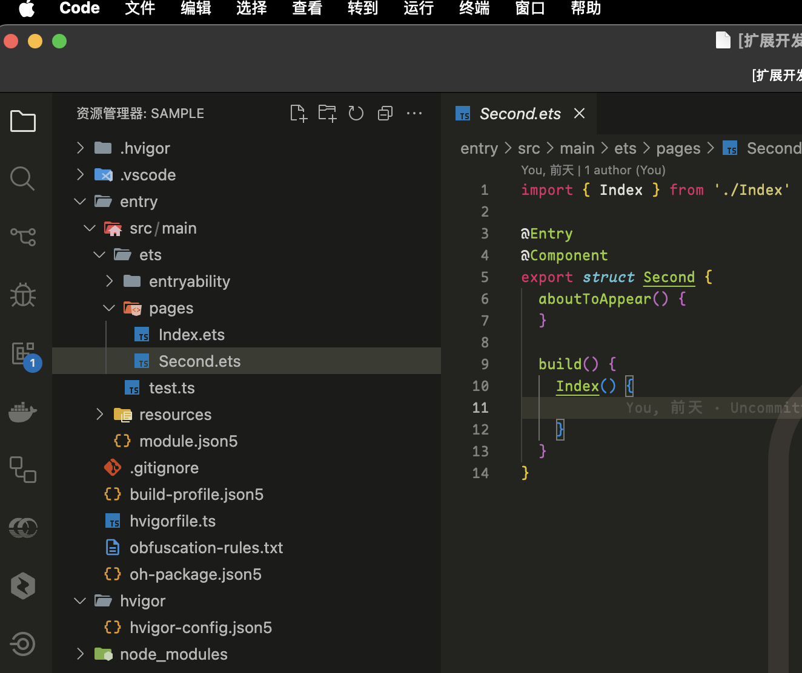

<div align="center">


# Naily's ArkTS Support

&nbsp;
[](https://marketplace.visualstudio.com/items?itemName=NailyZero.vscode-naily-ets)&nbsp;
[](https://www.npmjs.com/package/@arkts/declarations)&nbsp;
[](https://www.npmjs.com/package/@arkts/language-server)&nbsp;
&nbsp;
&nbsp;
&nbsp;

</div>

Language: <a href="./README.md">简体中文</a>｜English

> A QQ group has been created. Feel free to join for learning and discussion (Group ID: 746153004)

This is an ArkTS VSCode extension developed based on Volar. 🌹 It appears that there has been no proper support for ArkTS in VSCode until now. Most of the existing ArkTS extensions in the VSCode marketplace are very basic, so I decided to write one myself.

## Features

- 🌹 Starting from version 1.x, complete `ArkTS` language support is available, fully supporting all `ArkTS` syntax.
- 🖊️ Comprehensive JSON Schema support. Supports the following JSON Schema files:
  - `build-profile.json5` Module-level/Project-level configuration
  - `oh-package.json5` Module-level/Project-level configuration
  - `module.json5` Module-level/Project-level configuration
  - `code-linter.json5` Module-level/Project-level configuration
  - All `color.json` files under `resources/element/` for kv value configuration
  - `main_pages.json5`
- 📦 Starting from version 1.x, supports installation and management of `OpenHarmony SDK`, and automatically detects the `API version` of the currently opened project, showing popup prompts for `download` or `switch`
- 🆓 `$r`, `$rawfile` completion, code formatting, `hilog` logging and other features are planned for future support. PRs are welcomed 👀


## Extension Installation 📦

- Marketplace installation: [https://marketplace.visualstudio.com/items?itemName=NailyZero.vscode-naily-ets](https://marketplace.visualstudio.com/items?itemName=NailyZero.vscode-naily-ets)
- Open VSX installation: [https://open-vsx.org/extension/NailyZero/vscode-naily-ets](https://open-vsx.org/extension/NailyZero/vscode-naily-ets)

Or simply search for `ArkTS Support` in VSCode.

## Usage Guide 📖

### When DevEco Studio is already installed

After installing this extension, configure the `OpenHarmony SDK` path and `HMS SDK` path (optional), then restart the IDE. These two `SDK paths` are usually found in a folder called `sdk` in the `DevEco Studio` installation directory.

On macOS, right-click on `DevEco Studio` itself, select `Show Package Contents`, and you'll see a `sdk` folder inside the package containing `OpenHarmony SDK` and `HMS SDK`.

Generally, `OpenHarmony SDK` has the following directory structure (referenced from version `DevEco Studio 6.0 Beta 2`):

```
ets/
js/
native/
previewer/
toolchains/
```

`HMS SDK` generally has the following directory structure (referenced from version `DevEco Studio 6.0 Beta 2`):

```
ets/
native/
previewer/
toolchains/
```

### When DevEco Studio is not installed

Currently, this extension still cannot completely replace HarmonyOS development. It's recommended that you install `DevEco Studio`. If you really don't want to install it, the extension also provides `download`, `extract and install`, and `seamless switching` features for `OpenHarmony SDK`. After installing this extension, you can search for `> ETS: Install OpenHarmony SDK` in the command palette and follow the prompts step by step.

Additionally, the extension currently doesn't support `download`, `extract and install`, and `seamless switching` features for `HMS SDK`. Please download `DevEco Studio` or download HarmonyOS's `Command Line Tool` for installation.

## About `ets.baseSdkPath` ⚠️

This setting is used to configure the `base path` for `OpenHarmony SDK`. All versions of `OpenHarmony SDK` will be installed under this path.

If the path is configured as `${os.homedir}/OpenHarmony`, the extension will automatically install `OpenHarmony SDK` in the `~/OpenHarmony/[API version, number]` folder and automatically detect the `API version` used by the current project, automatically switching to the corresponding `OpenHarmony SDK`. For example, if you want to install `OpenHarmony SDK` for `API20`, the extension will automatically install it in the `~/OpenHarmony/20` folder:

```
~/OpenHarmony
├── 10
├── 18
└── 20
    └── ets/
    └── js/
    └── native/
    └── previewer/
    └── toolchains/
```

This behavior is completely consistent with the `Settings -> OpenHarmony SDK` feature in `DevEco Studio`.

## VSCode File Icon Pack 🖼️

It's recommended to use [Material Icon Theme](https://marketplace.visualstudio.com/items?itemName=PKief.material-icon-theme). I've submitted a PR to `Material Icon Theme`, and currently `.ets` and `.d.ets` files directly use the `TypeScript official file icon pack`. This is available in versions after upgrading to `v5.22.0`, making it look much better 👇



PR address: [https://github.com/material-extensions/vscode-material-icon-theme/pull/2966](https://github.com/material-extensions/vscode-material-icon-theme/pull/2966)

## Configuration

<!-- configs -->

| Key                | Description                                                                                                | Type      | Default                       |
| ------------------ | ---------------------------------------------------------------------------------------------------------- | --------- | ----------------------------- |
| `ets.sdkPath`      | %configuration.ets.sdkPath.description%                                                                    | `string`  | `""`                          |
| `ets.baseSdkPath`  | %configuration.ets.baseSdkPath.description%                                                                | `string`  | `"${os.homedir}/OpenHarmony"` |
| `ets.hmsPath`      | %configuration.ets.hmsPath.description%                                                                    | `string`  | `""`                          |
| `ets.lspDebugMode` | %configuration.ets.lspDebugMode.description%                                                               | `boolean` | `false`                       |
| `ets.hdcPath`      | %configuration.ets.hdcPath.description%                                                                    | `string`  | `""`                          |
| `ets.sdkList`      | A list of installed OpenHarmony SDK paths. Keys should follow the pattern API[number] (e.g., API9, API10). | `object`  | `{}`                          |

<!-- configs -->

## Commands

<!-- commands -->

| Command             | Title                        |
| ------------------- | ---------------------------- |
| `ets.restartServer` | ETS: %command.restartServer% |
| `ets.installSDK`    | ETS: %command.installSDK%    |

<!-- commands -->

## Star History 🌟

[](https://star-history.com/#Groupguanfang/arkTS&Date)

## Contact to Author 📧

- Telegram: [@GCZ_Zero](https://t.me/GCZ_Zero)
- X (Twitter): [@GCZ_Zero](https://x.com/GCZ_Zero)
- QQ: 1203970284，QQ Group: 746153004
- WeChat: gcz-zero

### Coffee ☕️

If this project helps you, consider buying the author a coffee ☕️

You can also join the QQ group for further discussions (Group ID: 746153004)

<div style="display: flex; gap: 5px;">


</div>

## License 📝

[MIT](./LICENSE)
