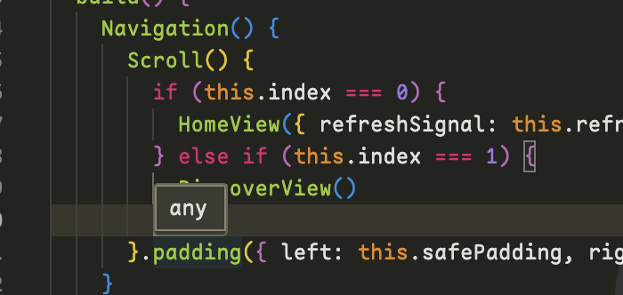
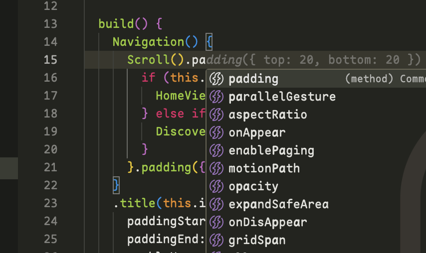

# Naily's ArkTS Support

基于Volar开发的ArkTS VSCode扩展。🌹为似乎到现在还没有支持VSCode，现有的ArkTS扩展都是非常简陋的，所以决定自己写一个。

- 🖊️ 完善的JSON Schema支持。支持以下文件的JSON Schema：
  - `build-profile.json5` 模块级别/项目级别配置
  - `oh-package.json5` 模块级别/项目级别配置
  - `module.json5` 模块级别/项目级别配置
  - `code-linter.json5` 模块级别/项目级别配置
  - `resources/element/`下所有的`color.json`等的kv值配置
  - `main_pages.json5`
- 🪐 `几乎`完美的ArkTS语法高亮，补全，`不支持诊断，欢迎PR`
- ✨ 支持源码跳转，注意暂时仅限ArkTS内部源码，import/export的暂未支持，欢迎PR

## 安装

Marketplace安装: [https://marketplace.visualstudio.com/items?itemName=NailyZero.vscode-naily-ets](https://marketplace.visualstudio.com/items?itemName=NailyZero.vscode-naily-ets)

或者直接在VSCode中搜索`ArkTS Support`即可。

## ArkTS源码跳转

ArkTS源码跳转需要依赖`@arkts/declarations`，所以需要在你的鸿蒙项目中用`npm`安装`@arkts/declarations`。

```bash
npm install @arkts/declarations
```

然后，在你的鸿蒙项目中的根目录下，创建一个`tsconfig.json`文件，或者修改现有的`tsconfig.json`文件，添加以下内容：

```json
{
  "extends": "@arkts/declarations/dist/tsconfig.base.json"
}
```

继承这个配置，然后，重启你的VSCode！！一定要重启你的VSCode，才会生效！代码提示最终效果如下图所示:


导入模块的时候也有相应提示（前提是你的`tsconfig.json`按照上面的要求配置对了）。导入模块的原理很简单，就是扫了一遍ArkTS官方的API，然后生成了一系列的`compilerOptions.paths` alias，你只管继承就行😋


点进去是完全没问题的，可以正常跳转。但是，很多地方还跳转不了，比如在Block Statement后面的`.`，如下图，目前还跳转不了，这个要搞起来非常非常之复杂，需要等待社区讨论，欢迎在issue中留下你的想法😌



### 小技巧

你可以在这里`.`一下，就会有对应的提示：



这也是暂时无奈之举，记得写完一定要把链式调用放后面，不然就不符合ArkTS语法了😂

## 其他

⚠️注意：目前该包是基于最新的`API 13`的，所以如果鸿蒙版本低于`API 13`，可能会有一些问题，欢迎PR。

## Star History

[](https://star-history.com/#Groupguanfang/arkTS&Date)
