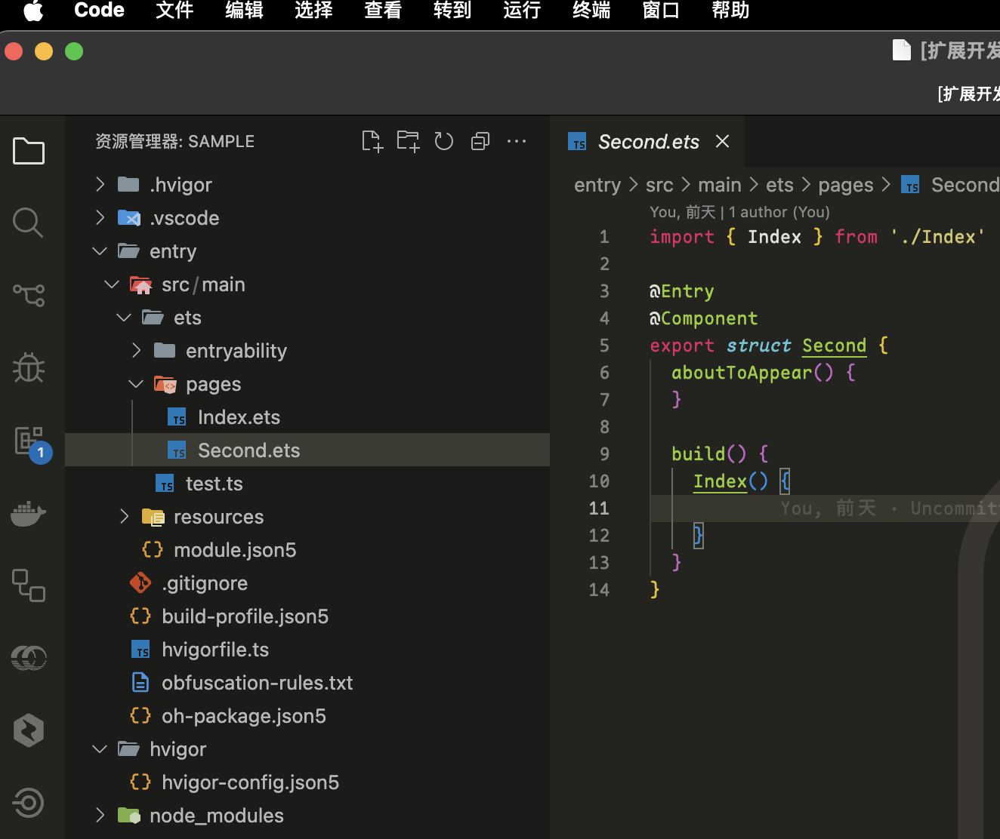
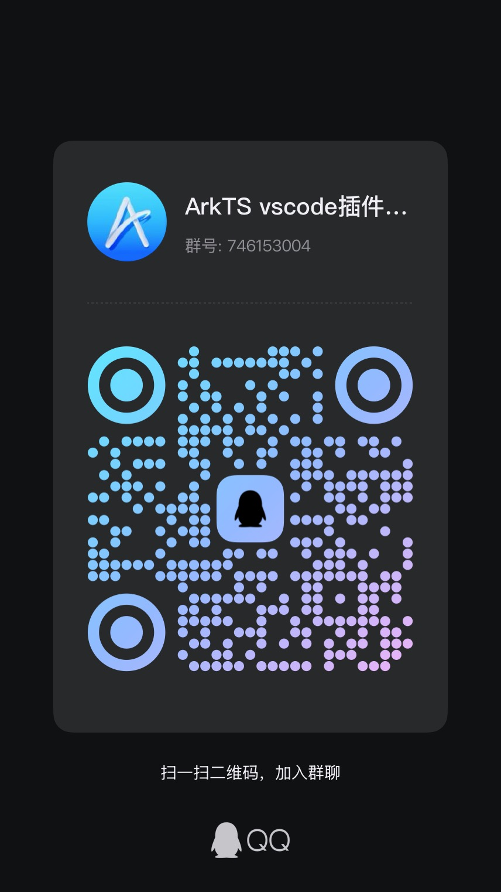

<div align="center">


# Naily's ArkTS Support

[English](./README-en.md) | 简体中文

&nbsp;
[](https://marketplace.visualstudio.com/items?itemName=NailyZero.vscode-naily-ets)&nbsp;
[](https://www.npmjs.com/package/@arkts/declarations)&nbsp;
[](https://www.npmjs.com/package/@arkts/language-server)&nbsp;
&nbsp;
&nbsp;
&nbsp;

</div>

语言：简体中文｜<a href="./README-en.md">English</a>

> 刚建了一个QQ群，欢迎加入一起交流学习 (群号: 746153004)

这是一个基于Volar开发的ArkTS VSCode扩展。🌹为似乎到现在还没有支持VSCode，现有的VSCode市场中的ArkTS扩展大都非常简陋，所以决定自己写一个。

## Features

- 🌹 1.x版本开始具备完整的`ArkTS`语言支持，全量支持所有`ArkTS`语法。
- 🖊️ 完善的JSON Schema支持。支持以下文件的JSON Schema：
  - `build-profile.json5` 模块级别/项目级别配置
  - `oh-package.json5` 模块级别/项目级别配置
  - `module.json5` 模块级别/项目级别配置
  - `code-linter.json5` 模块级别/项目级别配置
  - `resources/element/`下所有的`color.json`等的kv值配置
  - `main_pages.json5`
- 📦 1.x版本开始支持安装和管理`OpenHarmony SDK`，并且支持根据当前打开的项目自动探测`API版本`，发出弹窗提示`下载`或`切换`
- 🆓 `$r`，`$rawfile` 补全、代码格式化、`hilog`日志等功能正在计划支持的路上，欢迎PR👀


## 插件安装 📦

- Marketplace安装: [https://marketplace.visualstudio.com/items?itemName=NailyZero.vscode-naily-ets](https://marketplace.visualstudio.com/items?itemName=NailyZero.vscode-naily-ets)
- Open VSX安装：[https://open-vsx.org/extension/NailyZero/vscode-naily-ets](https://open-vsx.org/extension/NailyZero/vscode-naily-ets)

或者直接在VSCode中搜索`ArkTS Support`即可。

## 食用方法 📖

### 有装过`DevEco Studio`的情况下

安装本插件之后配置`OpenHarmony SDK`路径和`HMS SDK`路径（可选），然后重启IDE即可。这两个`SDK路径`一般都在`DevEco Studio`的安装目录下有个叫`sdk`的文件夹里可找到。

在MacOS下，一般右键`DevEco Studio`本身，选择`显示包内容`，然后就能看到包里面就有一个`sdk`的文件夹，里面就包含`OpenHarmony SDK`和`HMS SDK`。

一般情况下，`OpenHarmony SDK`基本都具备如下目录结构（参考自版本`DevEco Studio 6.0 Beta 2`）：

```
ets/
js/
native/
previewer/
toolchains/
```

`HMS SDK`基本都具备如下目录结构（参考自版本`DevEco Studio 6.0 Beta 2`）：

```
ets/
native/
previewer/
toolchains/
```

### 没有装过`DevEco Studio`的情况下

目前本插件仍然不能完全替代鸿蒙开发，建议您还是装一个`DevEco Studio`为好；如果实在是不想装那么插件内也提供`OpenHarmony SDK`的`下载`、`解压安装`、`无缝切换`功能，您可以在安装此插件之后，在`命令面板`中搜索`> ETS: Install OpenHarmony SDK`，按照提示一步步来即可。

另外，目前暂时插件不支持`HMS SDK`的`下载`、`解压安装`、`无缝切换`功能，请您自行下载`DevEco Studio`或下载鸿蒙的`Command Line Tool`进行安装。

## 关于`ets.baseSdkPath` ⚠️

此设置是用来配置`OpenHarmony SDK`的`基础路径`，所有版本的`OpenHarmony SDK`都会安装在此路径下。

假如该路径配置为`${os.homedir}/OpenHarmony`，那么插件会自动在`~/OpenHarmony/[API版本，数字]`文件夹下安装`OpenHarmony SDK`，并且会自动探测当前项目所使用的`API版本`，并自动切换到对应的`OpenHarmony SDK`。如你现在想安装`API20`的`OpenHarmony SDK`，那么插件会自动在`~/OpenHarmony/20`文件夹下安装`OpenHarmony SDK`：

```
~/OpenHarmony
├── 10
├── 18
└── 20
    └── ets/
    └── js/
    └── native/
    └── previewer/
    └── toolchains/
```

该行为和`DevEco Studio`中的`设置 -> OpenHarmony SDK`功能是完全一致的。

## VSCode 文件图标包 🖼️

推荐使用[Material Icon Theme](https://marketplace.visualstudio.com/items?itemName=PKief.material-icon-theme)，我已经给`Material Icon Theme`提交了PR，目前将`.ets`、`.d.ets`直接用上了`TypeScript官方的文件图标包`，升级到`v5.22.0`之后的版本都可用，这样至少好看一些了 👇



PR地址: [https://github.com/material-extensions/vscode-material-icon-theme/pull/2966](https://github.com/material-extensions/vscode-material-icon-theme/pull/2966)

## 配置

<!-- configs -->

| Key                | Description                                                                                                | Type      | Default                       |
| ------------------ | ---------------------------------------------------------------------------------------------------------- | --------- | ----------------------------- |
| `ets.sdkPath`      | %configuration.ets.sdkPath.description%                                                                    | `string`  | `""`                          |
| `ets.baseSdkPath`  | %configuration.ets.baseSdkPath.description%                                                                | `string`  | `"${os.homedir}/OpenHarmony"` |
| `ets.hmsPath`      | %configuration.ets.hmsPath.description%                                                                    | `string`  | `""`                          |
| `ets.lspDebugMode` | %configuration.ets.lspDebugMode.description%                                                               | `boolean` | `false`                       |
| `ets.hdcPath`      | %configuration.ets.hdcPath.description%                                                                    | `string`  | `""`                          |
| `ets.sdkList`      | A list of installed OpenHarmony SDK paths. Keys should follow the pattern API[number] (e.g., API9, API10). | `object`  | `{}`                          |

<!-- configs -->

## 命令

<!-- commands -->

| Command             | Title                        |
| ------------------- | ---------------------------- |
| `ets.restartServer` | ETS: %command.restartServer% |
| `ets.installSDK`    | ETS: %command.installSDK%    |

<!-- commands -->

## Star History 🌟

[](https://star-history.com/#Groupguanfang/arkTS&Date)


## Contact to Author 📧

- Telegram: [@GCZ_Zero](https://t.me/GCZ_Zero)
- X (Twitter): [@GCZ_Zero](https://x.com/GCZ_Zero)
- QQ: 1203970284，QQ群: 746153004
- WeChat: gcz-zero

### Coffee ☕️

如果觉得这个项目对你有帮助，可以请作者喝杯咖啡 ☕️

也可以加入QQ群，一起交流学习 (群号: 746153004)

<div style="display: flex; gap: 5px;">




</div>

## License 📝

[MIT](./LICENSE)
