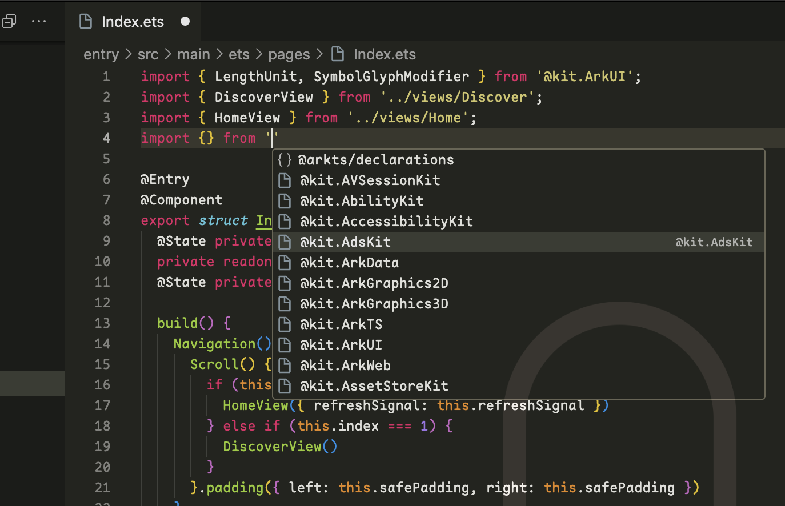
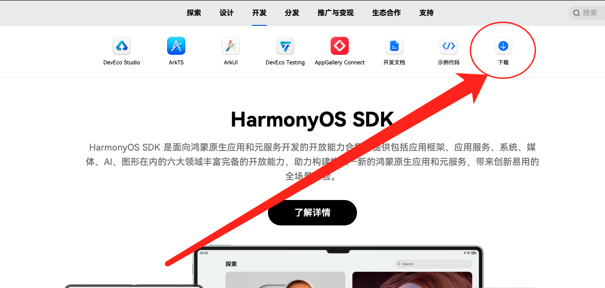
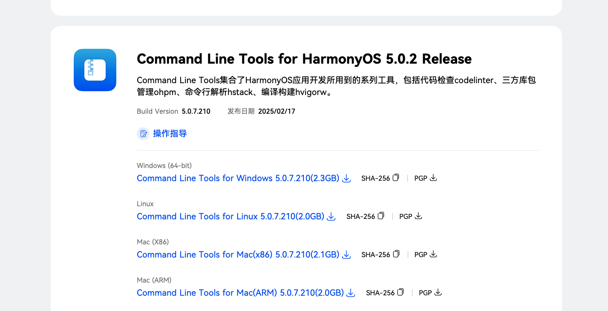
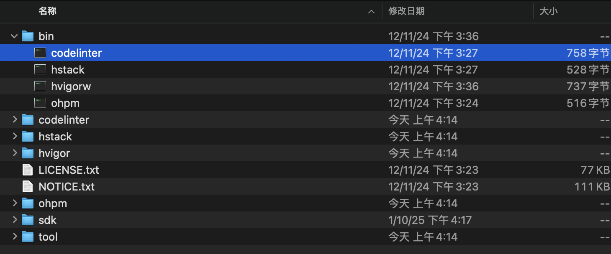

# Naily's ArkTS Support

基于Volar开发的ArkTS VSCode扩展。🌹为似乎到现在还没有支持VSCode，现有的ArkTS扩展都是非常简陋的，所以决定自己写一个。

> ⚠️注意：目前该包是基于最新的`API 13`的，所以如果鸿蒙版本低于`API 13`，可能会有一些问题，欢迎PR。

- 🖊️ 完善的JSON Schema支持。支持以下文件的JSON Schema：
  - `build-profile.json5` 模块级别/项目级别配置
  - `oh-package.json5` 模块级别/项目级别配置
  - `module.json5` 模块级别/项目级别配置
  - `code-linter.json5` 模块级别/项目级别配置
  - `resources/element/`下所有的`color.json`等的kv值配置
  - `main_pages.json5`
- 🪐 得益于强大的Volar，0.0.7版本升级之后，已经完美的ArkTS几乎所有语法高亮，补全😋👍
- ✨ 支持源码跳转，注意暂时仅限ArkTS内部源码，import/export的暂未支持，欢迎PR


## 安装

Marketplace安装: [https://marketplace.visualstudio.com/items?itemName=NailyZero.vscode-naily-ets](https://marketplace.visualstudio.com/items?itemName=NailyZero.vscode-naily-ets)

或者直接在VSCode中搜索`ArkTS Support`即可。

## ArkTS源码跳转

ArkTS源码跳转需要依赖`@arkts/declarations`，所以需要在你的鸿蒙项目中用`npm`安装`@arkts/declarations`。

```bash
npm install @arkts/declarations
```

然后，在你的鸿蒙项目中的根目录下，创建一个`tsconfig.json`文件，或者修改现有的`tsconfig.json`文件，添加以下内容：

```json
{
  "extends": "@arkts/declarations/dist/tsconfig.base.json",
  "compilerOptions": {
    "types": ["@arkts/declarations"],
    "lib": ["ESNext"], // 这样设置之后会排除掉DOM相关的类型，避免和ArkTS的类型冲突
    "experimentalDecorators": true, // ArkTS采用Stage2装饰器，所以需要开启

    // 基础的编译器选项和模块选项，建议这样配就行
    "target": "ESNext",
    "module": "ESNext",
    "moduleResolution": "bundler",

    // 建议开启严格模式
    "strict": true
  }
}
```

继承这个配置，然后，`重启你的VSCode`或者`保存一下这个文件`，ArkTS服务器会自动重载配置。


导入模块的时候也有相应提示（前提是你的`tsconfig.json`按照上面的要求配置对了）。导入模块的原理很简单，就是扫了一遍ArkTS官方的API，然后生成了一系列的`compilerOptions.paths` alias，你只管继承就行😋



## Code Linter

0.1.0版本开始增加对code linter的支持（你可以理解为ArkTS版的ESLint）。

启用方法很简单，首先[点击这里](https://developer.huawei.com/consumer/cn/develop/)打开HarmonyOS SDK官网，点击这里的`下载`，然后登录你的华为账号进入下载页面:



然后，下载你系统对应的`Command Line Tools`:



下载完成之后，解压到一个固定位置，然后你可以看到是这样一个目录结构，里头有个`bin`文件夹:



这个就是`codelinter`的可执行文件了。复制这个文件的`绝对路径`，然后打开`IDE`的`设置`，找到下面这个配置，然后填入你刚才复制的路径即可:


记得填写之后，一定要重启一下你的`IDE`，然后就可以看到效果了，比如：


这里的报错是提示你，为了性能，ForEach得有`keyGenerator`参数（即第三个参数）；当你填补了第三个参数之后，保存文件，`等待一会儿`（`codelinter`的运行需要时间），然后这个警告就会消失：


## Star History


[](https://star-history.com/#Groupguanfang/arkTS&Date)

## Contact to Author

- Telegram: [@GCZ_Zero](https://t.me/GCZ_Zero)
- X (Twitter): [@GCZ_Zero](https://x.com/GCZ_Zero)
- QQ: 1203970284
- WeChat: gcz-zero

### Coffee ☕️

如果觉得这个项目对你有帮助，可以请作者喝杯咖啡 ☕️

<div style="display: flex; gap: 10px;">


</div>

## License

[MIT](./LICENSE)
